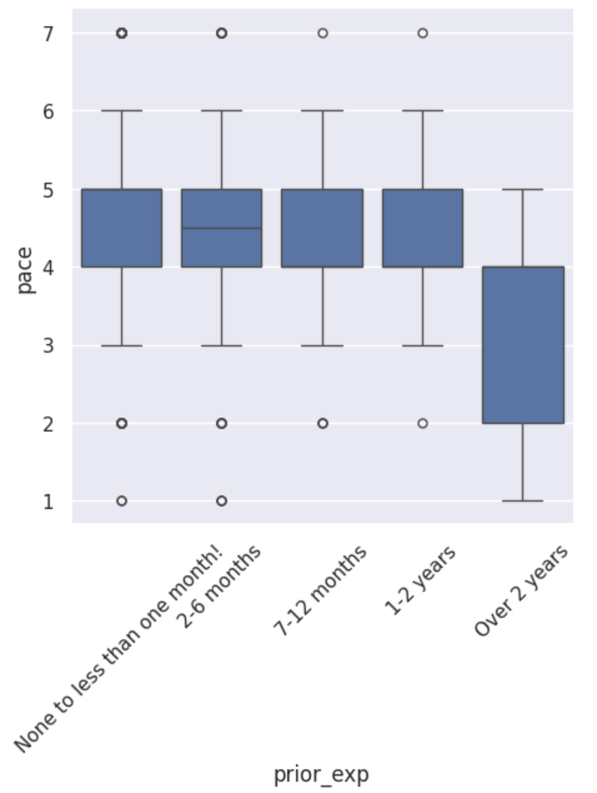
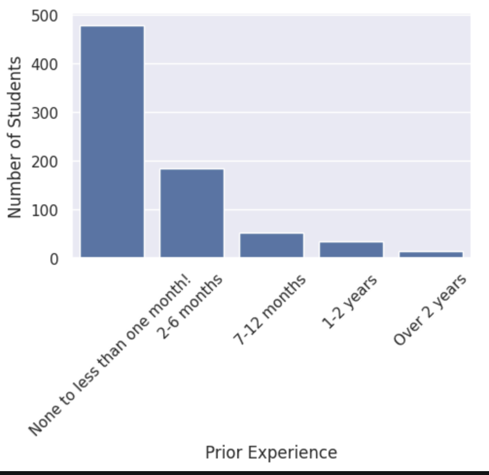
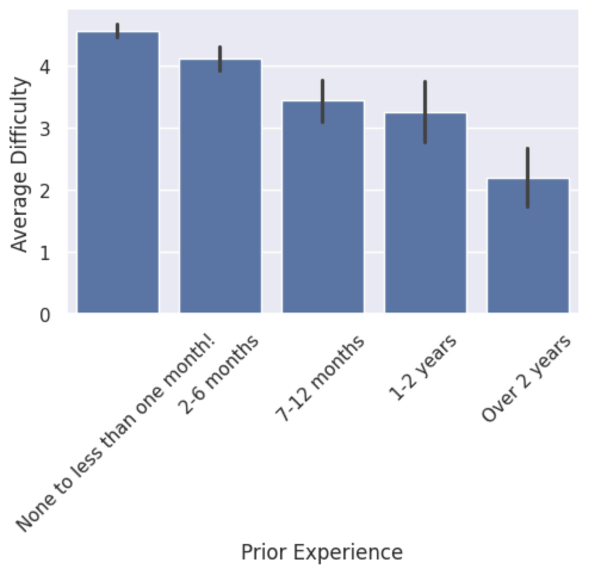
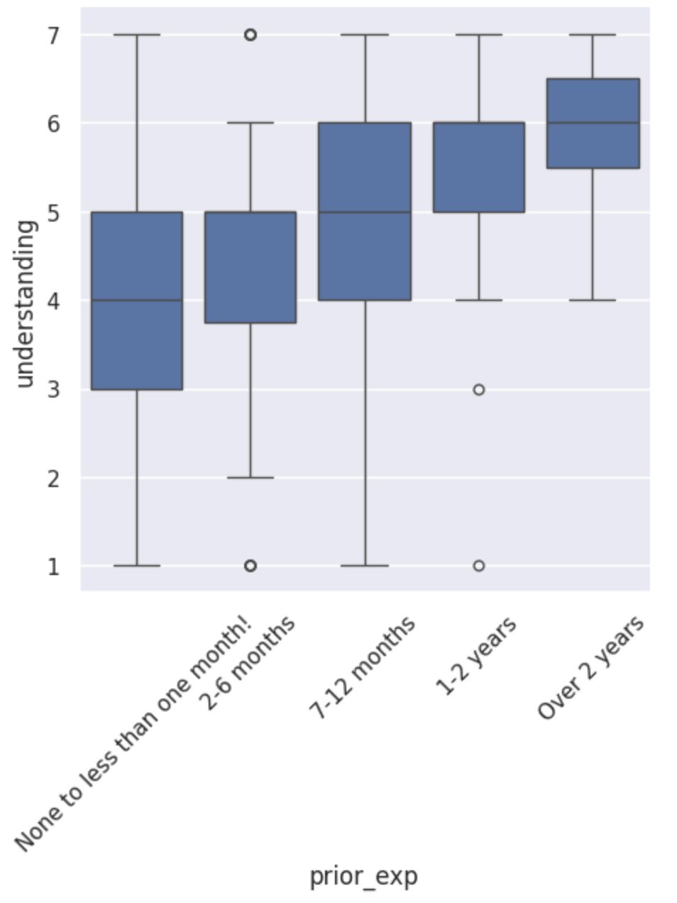
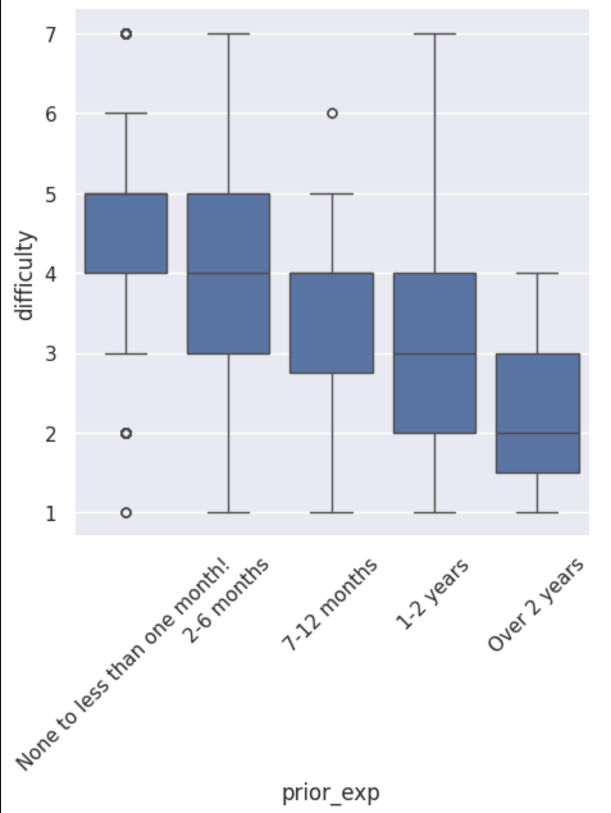

---
# Do not edit the text between these lines!
layout: default
---

# Data Analysis: Improving Course Design Based on Prior Experience

## Idea
The course should be split into optional learning tracks based on prior programming experience because students with different levels of experience may experience the course differently in terms of pace, difficulty, and understanding.

---

## Data Analysis
I analyzed survey data focusing on prior programming experience, perceived difficulty, course pace, and understanding.

The data shows a clear pattern: students with less prior experience report higher difficulty and lower understanding, while students with more experience report lower difficulty and higher understanding. Additionally, the variation in pace suggests that a single course structure does not equally serve all students.

This indicates a strong relationship between prior experience and how students experience the course.

---

## Visualizations

---

## Key Findings
- Students with little or no prior experience reported the highest difficulty  
- Students with more experience reported lower difficulty and higher understanding  
- Course pace varies significantly across experience levels  
- The class includes a wide range of experience levels  

---

## Recommendation
Based on the data, I recommend introducing optional or adaptive learning tracks.

A beginner track could include slower pacing, more foundational explanations, and additional support. An advanced track could include faster pacing and more challenging material.

---

## Conclusion
The data supports that prior programming experience significantly impacts student outcomes.

A single course structure does not equally serve all students. Introducing flexible learning paths would improve understanding for beginners and maintain engagement for advanced students.

---

## Trade-offs and Limitations
- Requires more effort from instructors  
- Adds complexity to course structure  
- Students may choose incorrect track  

just copy paste this on index.md and follow the instructions 